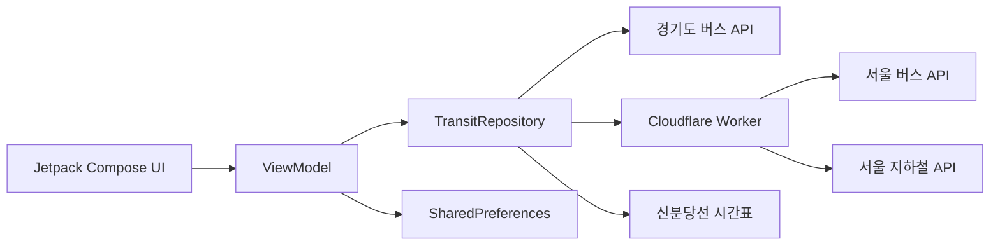

# CommuteStop

> 출근과 퇴근 때 확인하는 정류소와 역만 모아, 다음 교통편을 한 화면에서 빠르게 확인하는 Android 앱

CommuteStop은 자주 이용하는 서울·경기 버스 정류소와 지하철역을 출근·퇴근 프로필로 나눠 저장하고, 가장 가까운 도착 정보를 보여줍니다. 앱 표시명은 **출퇴근 정류장**입니다.

## 주요 기능

- 출근·퇴근 프로필마다 버스 정류소 또는 지하철역을 최대 3개까지 저장
- 서울·경기 버스 정류소를 검색하고 확인할 노선을 직접 선택
- 지하철역의 노선과 상행·내선/하행·외선 방향을 선택
- 버스 번호, 남은 정류장 수, 도착 예상 시간을 간결하게 표시
- 지하철의 행선지와 현재 위치 또는 다음 열차 예정 시각을 표시
- 프로필별 교통편 순서 변경과 삭제
- 출근·퇴근 프로필별 라이트/다크 테마 설정
- 설정한 기준 시각에 따라 앱을 열 때 보여줄 기본 프로필 자동 선택
- 저장한 교통편과 설정을 기기에 유지
- 앱을 보고 있는 동안 30초마다 도착 정보 자동 갱신

## 이용 흐름

1. 출근 또는 퇴근 프로필을 선택합니다.
2. 서울 버스, 경기 버스, 지하철 중 교통수단을 선택해 정류소나 역을 검색합니다.
3. 버스는 확인할 노선을, 지하철은 노선과 방향을 선택합니다.
4. 홈 화면에서 저장한 교통편의 가장 가까운 도착 정보를 확인합니다.
5. 설정에서 표시 순서, 프로필 테마, 출근·퇴근 전환 기준 시각을 변경합니다.

## 지원 교통 정보

| 교통수단 | 제공 기능 | 데이터 출처 |
| --- | --- | --- |
| 서울 버스 | 정류소 검색, 노선 선택, 실시간 도착 | 서울시 공식 버스 API |
| 경기 버스 | 정류소 검색, 노선 선택, 실시간 도착 | 경기도 공공데이터 API |
| 지하철 | 역 검색, 노선·방향 선택, 도착 정보 | 서울 열린데이터광장 API |
| 신분당선 | 방향별 다음 열차 예정 시각 | 신분당선 공식 시간표 |

실시간 도착 정보는 각 공공데이터 제공처의 응답 상황에 따라 지연되거나 제공되지 않을 수 있습니다. 신분당선 예정 시각은 내장된 평일·주말/공휴일 시간표를 사용하므로 실제 운행 상황과 차이가 날 수 있습니다.

## 동작 구조



서울 버스와 지하철 API는 HTTP 기반 원본 API를 앱에서 직접 호출하지 않도록 Cloudflare Worker가 HTTPS로 중계합니다. 경기 버스는 앱에서 경기도 공공데이터 API를 직접 호출합니다.

## 기술 스택

- Kotlin 2.2
- Jetpack Compose · Material 3
- Android Architecture Components · ViewModel
- Kotlin Coroutines · StateFlow
- SharedPreferences · JSON
- Cloudflare Workers
- JUnit 4

## 프로젝트 구조

```text
app/src/main/java/com/jcheol/commutestop
├── data/       # 공공데이터 API, 시간표, 로컬 설정 저장
├── domain/     # 교통편 모델, 정렬 및 표시 규칙
└── ui/         # Compose 화면과 ViewModel

seoul-transit-proxy-worker.js  # 서울 버스·지하철 HTTPS 프록시
wrangler.toml                   # Cloudflare Worker 설정
```

## 실행 준비

### 요구 환경

- Android Studio
- JDK 17
- Android SDK 36
- Android 7.0(API 24) 이상 기기 또는 에뮬레이터
- Node.js와 Wrangler CLI(서울 교통정보용 Worker를 직접 배포할 때만 필요)

### API 설정

프로젝트 루트의 `local.properties`에 사용할 데이터 키와 Worker 주소를 추가합니다. 실제 키가 들어간 `local.properties`는 Git에 커밋하지 않습니다.

```properties
PUBLIC_DATA_SERVICE_KEY=공공데이터포털_Decoding_키
SEOUL_TRANSIT_PROXY_URL=https://배포한-worker.workers.dev
```

`PUBLIC_DATA_SERVICE_KEY`에는 아래 서비스의 활용 승인을 받은 공공데이터포털 키를 사용합니다.

- [경기도 버스정류소 조회](https://www.data.go.kr/data/15080666/openapi.do)
- [경기도 버스도착정보 조회](https://www.data.go.kr/data/15080346/openapi.do)
- [서울특별시 정류소정보조회 서비스](https://www.data.go.kr/data/15000303/openapi.do)

API 설정 없이도 프로젝트를 빌드하고 단위 테스트를 실행할 수 있지만, 해당 교통수단의 검색과 도착 조회는 사용할 수 없습니다.

### 서울 교통정보 Worker

서울 버스와 지하철 기능을 사용하려면 서울 열린데이터광장 키를 준비한 뒤 저장소에 포함된 Worker를 배포합니다.

```bash
npx wrangler secret put SEOUL_OPEN_DATA_KEY
npx wrangler secret put SEOUL_SUBWAY_KEY
npx wrangler secret put PUBLIC_DATA_SERVICE_KEY
npx wrangler deploy
```

배포가 끝나면 Worker의 HTTPS 주소를 `SEOUL_TRANSIT_PROXY_URL`에 설정합니다. Worker는 검색 결과를 1시간, 실시간 도착 정보를 20초 동안 캐시합니다.

## 빌드와 테스트

```bash
./gradlew :app:testDebugUnitTest
./gradlew :app:assembleDebug
```

생성된 디버그 APK는 `app/build/outputs/apk/debug/app-debug.apk`에서 확인할 수 있습니다.
